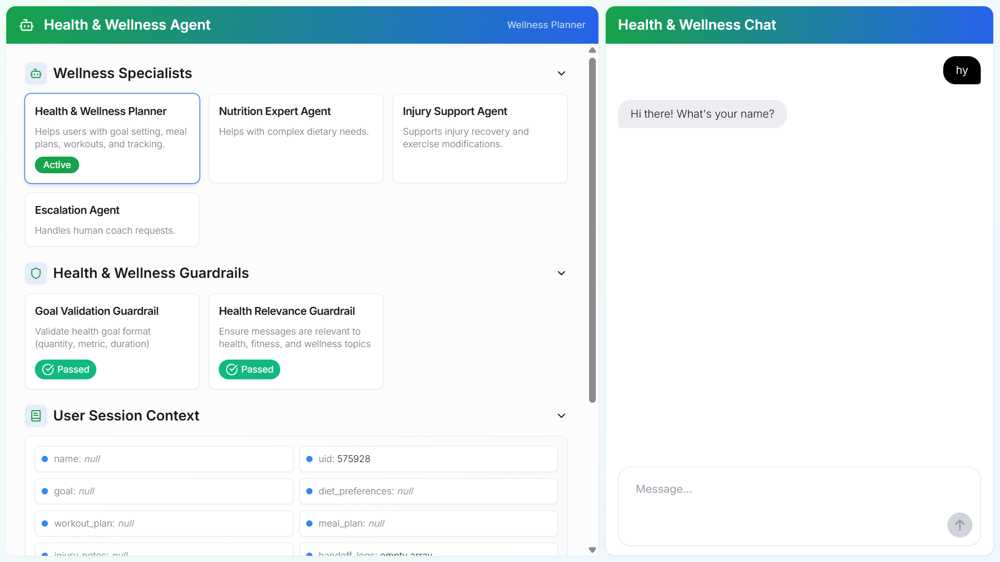

# Health & Wellness Planner Agent

[](LICENSE)


This repository contains a demo of a Health & Wellness Planner Agent interface built on top of the [OpenAI Agents SDK](https://openai.github.io/openai-agents-python/).
It is composed of two parts:

1. A python backend that handles the agent orchestration logic, implementing a comprehensive health and wellness planning system

2. A Next.js UI allowing the visualization of the agent orchestration process and providing a chat interface for health and wellness planning.



## How to use

### Setting your OpenAI API key

You can set your OpenAI API key in your environment variables by running the following command in your terminal:

```bash
export OPENAI_API_KEY=your_api_key
```

You can also follow [these instructions](https://platform.openai.com/docs/libraries#create-and-export-an-api-key) to set your OpenAI key at a global level.

Alternatively, you can set the `OPENAI_API_KEY` environment variable in an `.env` file at the root of the `python-backend` folder. You will need to install the `python-dotenv` package to load the environment variables from the `.env` file.

### Install dependencies

Install the dependencies for the backend by running the following commands:

```bash
cd python-backend
python -m venv .venv
source .venv/bin/activate
pip install -r requirements.txt
```

For the UI, you can run:

```bash
cd ui
npm install
```

### Run the app

You can either run the backend independently if you want to use a separate UI, or run both the UI and backend at the same time.

#### Run the backend independently

From the `python-backend` folder, run:

```bash
python -m uvicorn api:app --reload --port 8000
```

The backend will be available at: [http://localhost:8000](http://localhost:8000)

#### Run the UI & backend simultaneously

From the `ui` folder, run:

```bash
npm run dev
```

The frontend will be available at: [http://localhost:3000](http://localhost:3000)

This command will also start the backend.

## Features

### 🤖 Agents
- **Health & Wellness Planner**: Main agent that coordinates all health and wellness activities
- **Nutrition Expert**: Specialized agent for dietary planning and nutrition advice
- **Injury Support**: Agent for safe exercise modifications and injury recovery
- **Escalation Agent**: Handles requests to speak with human coaches

### 🛠️ Tools
- **Goal Analyzer**: Converts user health goals into structured format
- **Meal Planner**: Generates 7-day meal plans based on dietary preferences
- **Workout Recommender**: Suggests workout plans based on goals and experience
- **Check-in Scheduler**: Schedules recurring weekly progress checks
- **Progress Tracker**: Tracks user progress and updates session context
- **Workout Selector**: Interactive UI for choosing workout types

### 🔒 Guardrails
- **Goal Validation**: Ensures health goals follow proper format (quantity, metric, duration)
- **Health Relevance**: Validates that messages are related to health, fitness, and wellness topics

### 📊 Context Management
The system maintains comprehensive user session context including:
- User profile (name, ID)
- Health goals and objectives
- Dietary preferences
- Workout plans
- Meal plans
- Injury notes
- Handoff logs
- Progress tracking

## Demo Flows

### Demo flow #1: Goal Setting & Meal Planning

1. **Start with a health goal:**
   - User: "I want to lose 5kg in 2 months"
   - The Health & Wellness Planner will analyze your goal and create a structured plan.

2. **Dietary preferences:**
   - User: "I'm vegetarian"
   - The system will generate a 7-day vegetarian meal plan tailored to your weight loss goal.

3. **Workout planning:**
   - User: "I need a workout plan for beginners"
   - The system will recommend a suitable workout plan and show the interactive workout selector.

4. **Progress tracking:**
   - User: "I lost 1kg this week"
   - The system will log your progress and adjust recommendations accordingly.

### Demo flow #2: Specialized Support

1. **Injury support:**
   - User: "I have knee pain, can you help me with safe exercises?"
   - The system will hand off to the Injury Support Agent for safe exercise modifications.

2. **Complex dietary needs:**
   - User: "I'm diabetic and need a special meal plan"
   - The system will hand off to the Nutrition Expert Agent for specialized dietary planning.

3. **Human support:**
   - User: "I want to speak to a real trainer"
   - The system will hand off to the Escalation Agent to connect you with a human coach.

## Customization

This app is designed for demonstration purposes. Feel free to update the agent prompts, guardrails, and tools to fit your own health and wellness workflows or experiment with new use cases! The modular structure makes it easy to extend or modify the orchestration logic for your needs.

## Contributing

You are welcome to open issues or submit PRs to improve this app, however, please note that we may not review all suggestions.

## License

This project is licensed under the MIT License. See the [LICENSE](LICENSE) file for details.
